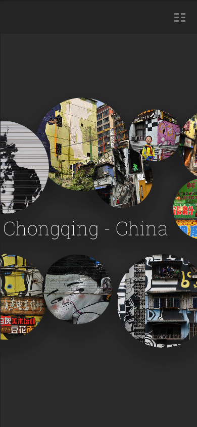
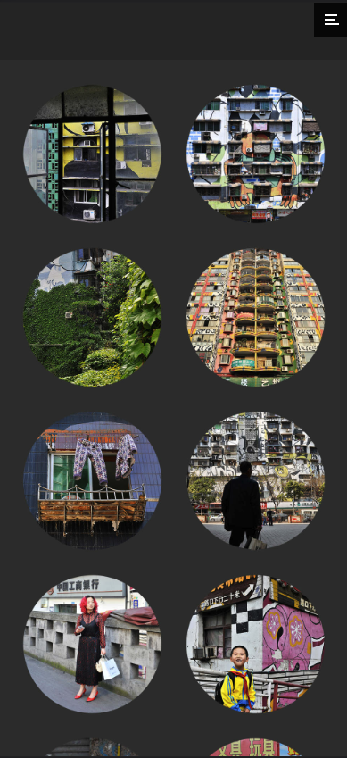
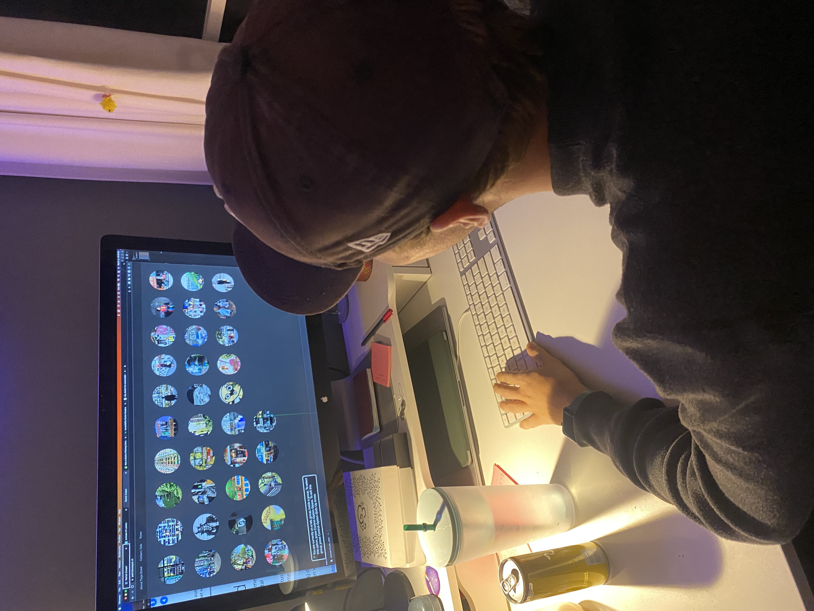
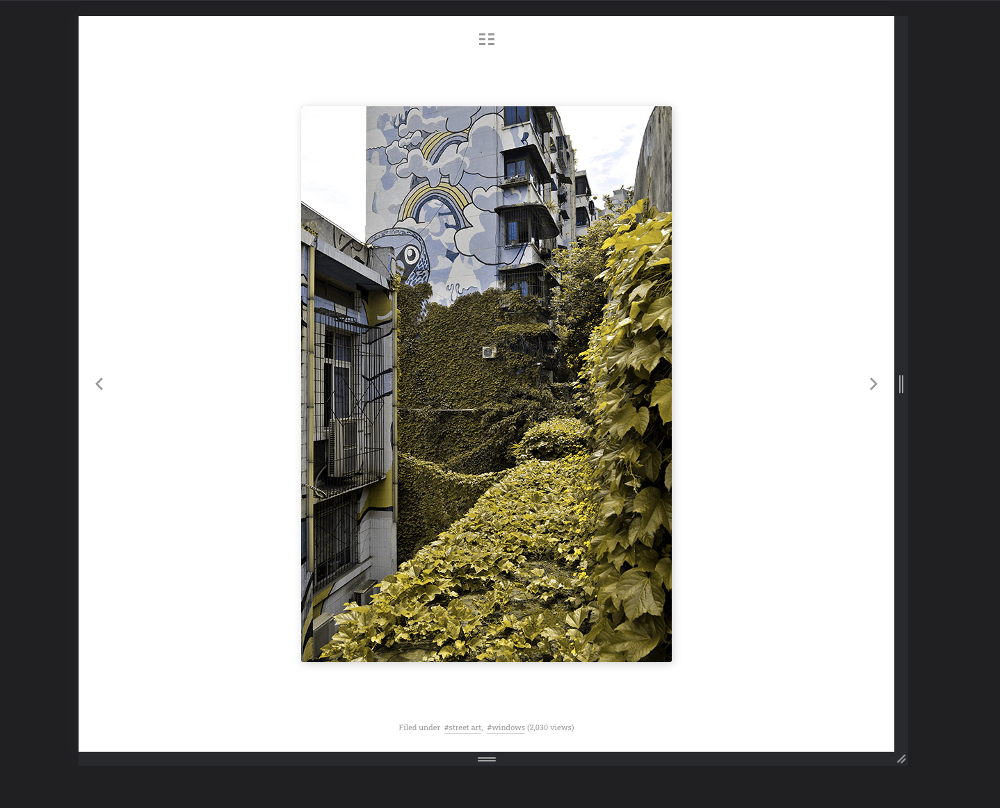
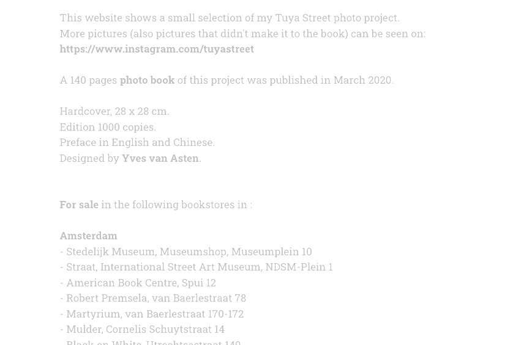
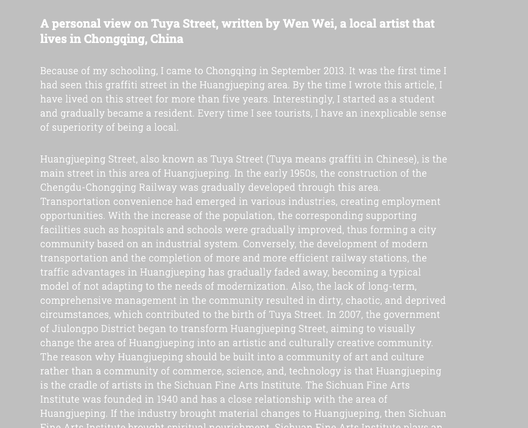
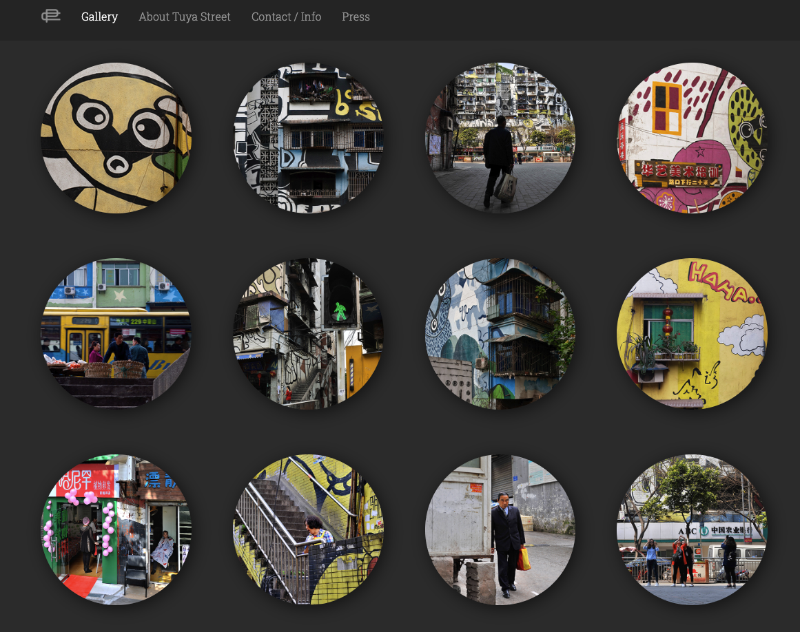
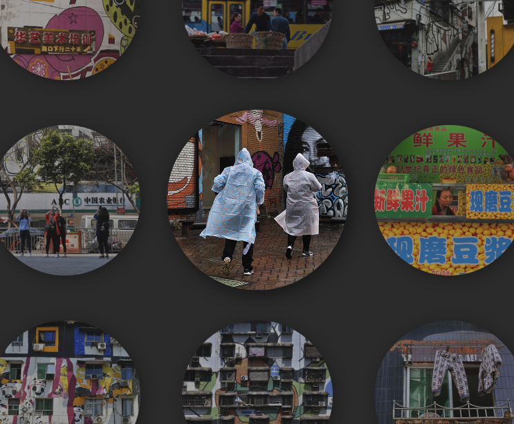
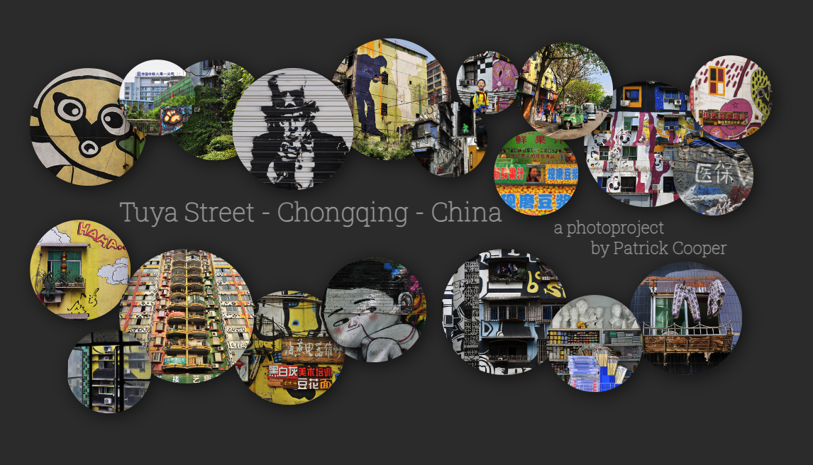
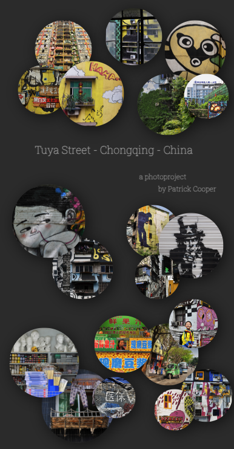

# Procesverslag
Markdown is een simpele manier om HTML te schrijven.  
Markdown cheat cheet: [Hulp bij het schrijven van Markdown](https://github.com/adam-p/markdown-here/wiki/Markdown-Cheatsheet).

Nb. De standaardstructuur en de spartaanse opmaak van de README.md zijn helemaal prima. Het gaat om de inhoud van je procesverslag. Besteedt de tijd voor pracht en praal aan je website.

Nb. Door *open* toe te voegen aan een *details* element kun je deze standaard open zetten. Fijn om dat steeds voor de relevante stuk(ken) te doen.

## Jij

  
uitwerken voor kick-off werkgroep

  ### Auteur:
  Ruby Heiting

  #### Je startniveau:
  Blauw

  #### Je focus:
  Surface plane
 

## Je website

  
uitwerken voor kick-off werkgroep

  ### Je opdracht:
  https://www.patrickcooper.nl/

  Ik heb besloten om mijn vaders website te gebruiken voor mijn verslag, omdat hij deze al geruime tijd heeft en het tijd was voor een update. In het verleden heeft mijn moeder de website gemaakt met behulp van een CMS (Content Management System, zoek naar de naam), en dit werkte redelijk goed voor wat hij nodig had. Het enige probleem was dat de hostingkosten vrij hoog waren en dat de website niet volledig aanpasbaar was. Daarom leek het me een leuk idee om de website zelf na te maken voor deze opdracht.

Bij het bekijken van de bestaande website merkte ik al snel dat bepaalde aspecten niet goed werkten of niet logisch waren. Zo was de navigatie onduidelijk en verwarrend. Ook zag ik dat de knop voor de galerijpagina erg leek op het hamburgermenu en op een vreemde manier gecentreerd stond. Bovendien was er geen duidelijke manier om terug te gaan naar het startscherm, tenzij je de URL aanpaste.

Ik heb uitgebreid met mijn vader gesproken over mogelijke verbeteringen. Na het afronden van deze opdracht ben ik van plan om nog een aantal extra ideeën uit te werken, zoals het toevoegen van meer foto's (aangezien de huidige selectie erg klein en verouderd is) en het uitbreiden van de website met informatie over andere projecten waar hij mee bezig is.

  #### Screenshot(s) van de eerste pagina (small screen): 
  hier de naam van de pagina  
  

  #### Screenshot(s) van de tweede pagina (small screen):
  hier de naam van de pagina  
  
 

## Toegankelijkheidstest 1/2 (week 1)

  
uitwerken na test in 1e werkgroep

  ### Bevindingen
  Ik vroeg mijn klasgenoot Ruud om als eerste de originele website te testen met behulp van een screenreader, muis/toetsenbord en kleurfilters om beperkingen na te bootsen. Tijdens het testen heb ik aantekeningen gemaakt van zijn bevindingen. Hier zijn de herformuleringen:

  #### Screenreader
  - De screenreader leest de tekst niet voor en blijft hangen in de header.
- Op de galerijpagina navigeer je verticaal in plaats van horizontaal.
- De linkjes zijn niet duidelijk in hun functie (alleen de navigatie is begrijpelijk).

  Dit kan waarschijnlijk makkelijk opgelost worden door een betere 'semantische' opbouw.

  

  Algemeen:
  - De navigatie is onduidelijk.
- Er is geen manier om terug te keren naar de homepagina.
- Het icoon voor de galerij is onduidelijk en staat op een vreemde plek.
- Wanneer je op een individuele foto bent, kun je niet direct naar een andere pagina gaan (je moet eerst terug naar de galerij).

  #### Muis en Toetsenbord 
  - Je kunt niet handmatig door de linkjes navigeren (alleen met de screenreader).
- Met de pijltjestoetsen kun je wel door de verschillende foto's bladeren.
- Er zijn geen interessante hover-effecten.
- Er is geen donkere/lichte modus beschikbaar.

  #### Visueel (brillen, contrast, kleurenblind, dark/light). 
  - Bij verminderd contrast is de tekst nog steeds leesbaar, maar het kan moeilijk zijn.
- Verder zijn alle teksten leesbaar (hoewel de foto's er niet meer zo mooi uitzien ;)).

  
  

## Toegankelijkheidstest 2/2 (week 4)

  
uitwerken na test in 8e werkgroep

  ### Bevindingen

  #### Screenreader
  Tijdens het testen met een screenreader heb ik verschillende verbeteringen kunnen aanbrengen. De tekst op de website wordt nu correct voorgelezen en het navigeren is aanzienlijk verbeterd. Hierdoor is het voor gebruikers met een visuele beperking veel eenvoudiger om de inhoud van de website te verkennen. Bovendien heb ik bij elke foto duidelijke beschrijvingen toegevoegd, zodat zelfs mensen die blind zijn kunnen horen wat er op elke foto te zien is. Dit draagt bij aan een inclusieve ervaring voor alle bezoekers.

  Ik heb hiervoor eigenlijk niet iets bijzonder gedaan. Na je correct en semantisch opbouwen van de website werkte het uit zichzelf.

Algemeen:
De navigatie van de website is vereenvoudigd en duidelijker gemaakt. Ik heb ervoor gezorgd dat gebruikers te allen tijde gemakkelijk terug kunnen naar elke gewenste pagina. Dit zorgt voor een betere gebruikerservaring en voorkomt verwarring bij het navigeren door de website.

Met deze aanpassingen heb ik de toegankelijkheid en gebruiksvriendelijkheid van de website vergroot, waardoor een breder publiek de website kan bezoeken en ervan kan genieten. Het is belangrijk om ervoor te zorgen dat alle gebruikers, ongeacht hun beperkingen, op een toegankelijke manier toegang hebben tot de inhoud en functionaliteit van de website.

  #### Muis en Toetsenbord 
  Tijdens het testen met een muis en toetsenbord heb ik verbeteringen aangebracht om een soepele en intuïtieve gebruikerservaring te garanderen. Het navigeren door de website met de muis en het gebruik van het toetsenbord verloopt nu goed. Gebruikers kunnen gemakkelijk klikken op linkjes en interactieve elementen, waardoor ze moeiteloos door de website kunnen navigeren.

Vergeleken met de originele test zijn er aanzienlijke verbeteringen zichtbaar. Waar voorheen problemen waren met het handmatig navigeren door linkjes, is dat nu opgelost. Gebruikers kunnen nu zelfstandig en zonder obstakels door de website bladeren en de gewenste inhoud ontdekken.

  #### Visueel (brillen, contrast, kleurenblind, dark/light). 
  Ik heb twee belangrijke verbeteringen aangebracht met betrekking tot kleuren: het toevoegen van een dark mode en het verbeteren van het contrast voor gebruikers met kleurenblindheid.

Dark en light mode:
Om de gebruikerservaring te verbeteren en tegemoet te komen aan de voorkeuren van gebruikers, heb ik een dark mode toegevoegd aan de website. Hoewel dark mode standaard is ingesteld, heb ik ook een toggle toegevoegd, zodat gebruikers zelf kunnen kiezen welke modus ze willen gebruiken. Hierdoor kunnen ze de website aanpassen aan hun persoonlijke voorkeuren en omgevingsomstandigheden.

Kleurenblindheid:
Hoewel de kleuren zelf onveranderd zijn gebleven, heb ik door de donkere achtergrond met witte letters het contrast sterk verbeterd. Dit draagt bij aan een betere leesbaarheid voor gebruikers met kleurenblindheid of visuele beperkingen. Het vergroten van het contrast zorgt ervoor dat de tekst duidelijker zichtbaar is en gemakkelijker te onderscheiden is van de achtergrond.

## Eindgesprek (week 5)

  
uitwerken voor eindgesprek

  ### Je uitkomst - karakteristiek screenshots:
  Ondanks de uitdagingen en obstakels die ik tijdens het proces ben tegengekomen, ben ik trots op de uiteindelijke uitkomst van de website. Door mijn inspanningen en het implementeren van verbeteringen is de website nu veel gebruiksvriendelijker en beter toegankelijk geworden. De responsiviteit van de website is verbeterd, waardoor deze nu op verschillende apparaten en schermformaten goed wordt weergegeven.

Daarnaast ben ik erin geslaagd om de foto's op de galerij- en homepagina correct te linken naar de individuele foto's. Dit zorgt voor een soepele navigatie en een betere gebruikerservaring voor de bezoekers van de website. Door deze aanpassingen is de website nu veel effectiever in het overbrengen van de inhoud en het tonen van de fotoreportages aan het publiek.

Ik vind het ook erg leuk om deze zomer verder te gaan en de website verder uit te breiden met alle andere projecten waar mijn vader mee bezig is.

  ### Dit ging goed/Heb ik geleerd: 
  Ondanks een aantal tegenslagen heb ik tijdens het bouwen van de website veel geleerd. Ik heb me vooral gericht op het gebruik van "display: grid", en dit heeft me enorm geholpen. Ik begrijp nu echt de meerwaarde ervan en hoe goed het werkt voor het creëren van een flexibele layout. Ik zal dit zeker in de toekomst opnieuw gebruiken en verder verkennen. Daarnaast ben ik ook erg blij met de kleine extratjes die ik toegevoegd aan bijvoorbeeld de gallerij waar een hover op zit zodat je die foto goed ziet en de rest wat minder. Hij wordt in het "spotlicht" gezet.

  
  

  Ook heb ik het homescherm volledig opnieuw moeten opbouwen. Dit was origineel 1 foto die in het scherm geplaatst was. Ik wilde graag gebruikers de mogelijkheid geven om meteen naar één van die fotos te kunnne. Dus moest het stuk voor stuk gepositioneerd worden. Dit heb ik met position absolute gedaan met een box waar ze allemaal netjes inblijven. Vervolgens heb ik ook nog een mobiele versie gemaakt. Hiervoor moest ik helemaal opnieuw beginnen en een nieuwe layout bedenken.

  
  

  ### Dit was lastig/Is niet gelukt:
  Tijdens het proces van het maken van de website ben ik tegen verschillende uitdagingen aangelopen. Bijna elke pagina moest ik meerdere keren opnieuw beginnen omdat de responsiviteit niet goed werkte. Ook heb ik veel moeite gehad met het linken van de foto's op de galerij- en homepagina naar de individuele foto's. Deze obstakels hebben me de nodige tijd en moeite gekost.

